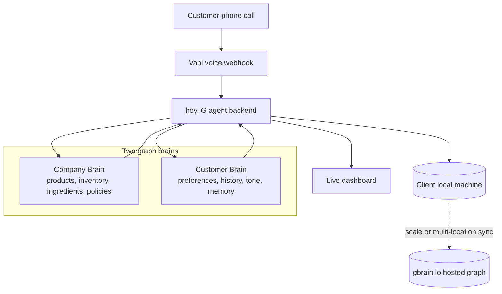

<p align="center">
  
</p>

# hey, G

**AI voice concierge with memory**

Seventy percent of shopping carts get abandoned. Two hundred sixty billion dollars walks out the door every year because companies and customers are speaking different languages.

hey, G fixes the gap with a phone call.

You call any business and you are talking to an agent that knows two things: the business inside out, and you. We call them the **Company Brain** and the **Customer Brain**. The Company Brain knows every product, ingredient, menu item, inventory row, and policy. The Customer Brain knows your preferences, history, and how you like to be spoken to. Two graphs meet on every call.

A new customer who has never ordered at Starbucks can ask for "something warm and sweet like chai back home" and get the right drink, no jargon required. A regular at Costco gets greeted by name with a suggestion based on what they bought last time.

Every hey, G deployment runs fully local on the client's own machine: their menu, their customers, their memory, all on their hardware. For clients that want to scale or share memory across locations, hey, G plugs straight into [gbrain.io](https://gbrain.io) for the hosted version. Same brain, same graph shape, same skills: local by default, cloud when ready. No migration, no rewrite.

Voice bots answer calls. **hey, G remembers customers.**

## Demo Flow

1. **Call** - A customer phones a business and speaks naturally.
2. **Understand** - The agent queries the Company Brain for products, policies, and constraints.
3. **Personalize** - The agent queries the Customer Brain for preferences, prior orders, allergies, language, and tone.
4. **Recommend** - The two graphs meet and translate customer intent into the right business action.
5. **Remember** - The conversation updates memory so the next call starts with context.

## Architecture

| Layer | Stack | Role |
| --- | --- | --- |
| **Voice** | Vapi webhook | Receives live phone calls and streams the customer conversation into the agent loop |
| **Agent Backend** | Node.js / TypeScript / Railway | Runs `yc-gbrain/server`, routes calls, searches company data, writes orders, and coordinates memory |
| **Dashboard** | Next.js / React / Vercel | Runs `yc-gbrain/dashboard` and shows live demo state, customer context, and company-brain activity |
| **Company Brain** | Local graph data / HOG research dataset / optional gbrain.io mirror | Stores business knowledge such as Costco inventory, Starbucks products, policies, and constraints |
| **Customer Brain** | Local memory graph / gbrain.io hosted graph | Stores persistent customer preferences, order history, language, tone, and context |
| **Durable State** | Convex | Mirrors demo state and HOG-backed catalog data for the hosted demo path |



## How The Brains Work

The **Company Brain** is the business speaking in its own language: product names, sizes, substitutions, store policies, inventory, ingredients, and operational rules.

The **Customer Brain** is the person speaking in theirs: "not too sweet," "like chai back home," "the usual breakroom order," "my team avoids peanuts," "talk to me in Spanish," "keep it under $250."

The agent's job is to map one language to the other. That is the product: not a voice bot, but a persistent translation layer between how companies describe what they sell and how customers describe what they want.

## Key Endpoints

```txt
GET  /health             -> service status
GET  /api/dashboard      -> live dashboard state
GET  /api/companies      -> configured company brains
GET  /api/customers/:id  -> customer brain snapshot
GET  /api/calls/active   -> active voice call state
GET  /api/gbrain/local/status -> local GBrain mode and seed status
POST /api/context        -> customer and company context lookup
POST /api/search         -> company-brain search
POST /api/save_order     -> order and memory write
POST /api/learn          -> memory learning event
POST /api/gbrain/local/query -> local customer/company graph query
POST /api/demo/reset     -> reset hosted demo state
POST /api/vapi/webhook   -> Vapi call entrypoint
```

## Quickstart

```bash
npm install
npm run dev
```

Useful checks:

```bash
npm run typecheck
npm run build
npm --workspace @pulse/server run typecheck
npm --workspace @pulse/server run build
```

Vapi should point at:

```txt
https://<railway-domain>/api/vapi/webhook
```

Minimum hosted demo env:

```txt
NODE_ENV=production
FRONTEND_URL=https://web-five-ruby-11.vercel.app
DASHBOARD_ORIGIN=https://web-five-ruby-11.vercel.app
DEMO_PHONE=+13203648288
VAPI_API_KEY=
VAPI_SECRET=
VAPI_ASSISTANT_ID=
VAPI_PHONE_NUMBER_ID=
GBRAIN_API_KEY=
GBRAIN_BASE_URL=
GBRAIN_PROJECT_ID=
GBRAIN_LOCAL_ENABLED=false
```

## Demo Calls

```txt
Can you reorder my usual breakroom stuff from Costco? My number is 6697320048.
```

```txt
I need snacks and drinks for 35 people under $250, no peanuts, preferably Kirkland.
```

```txt
I do not know Starbucks words. I want something warm, cozy, oat milk, and not too sweet.
```

## Why We Built It

This one's personal. I watched my parents avoid ordering at Starbucks for 25 years, not because of language, but because the gap between how a company talks about itself and how a customer thinks about what they want is enormous. That gap is everywhere. Every scroll, every order, every conversation a customer has with a business is full of context that usually evaporates.

We had a great time building this. Huge thanks to the judges, founders, and VCs who gave us real feedback throughout the weekend. A lot of what is in the final pitch came from those conversations.

Hope it shows.

## GBrain.io and HOG

The reason this project was possible is GBrain. The thesis that every customer has a rich, persistent memory worth carrying across every business they interact with only works if there is somewhere to store that memory in a way that is queryable, durable, and shaped like how humans actually remember things. GBrain gave us that layer without turning memory into a hack. hey, G runs local by default, and uses [gbrain.io](https://gbrain.io) when a client wants hosted memory, shared memory across locations, or a cloud-backed deployment path.

We used HOG for the Costco Company Brain integration. We ran HOG's deep research on Costco inventory to create the dataset that powers Costco product lookup, recommendation, and order reasoning. The explicit research-backed data lives in `hog-data/`, the runtime copy used by the Railway backend lives in `yc-gbrain/server/data/`, and the HOG market-intelligence brief lives in `data/intel/costco-intel.md` for graph search and voice-agent talking points.
